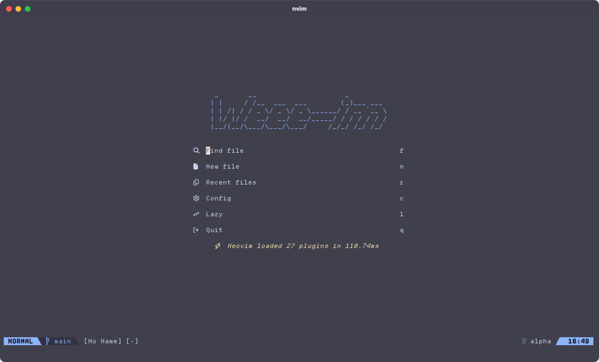

# My Neovim Config

# Colorscheme
- Catppuccin Mocha

## Plugins
- windwp/nvim-autopairs
- onsails/lspkind.nvim
- hrsh7th/nvim-cmp
- jinzhongjia/LspUI.nvim
- nvim-treesitter/nvim-treesitter
- mason-org/mason-lspconfig.nvim
- nvim-telescope/telescope.nvim
- stevearc/conform.nvim
- nvim-neo-tree/neo-tree.nvim
- lukas-reineke/indent-blankline.nvim
- akinsho/bufferline.nvim
- nvim-lualine/lualine.nvim
- lewis6991/gitsigns.nvim
- goolord/alpha-nvim
